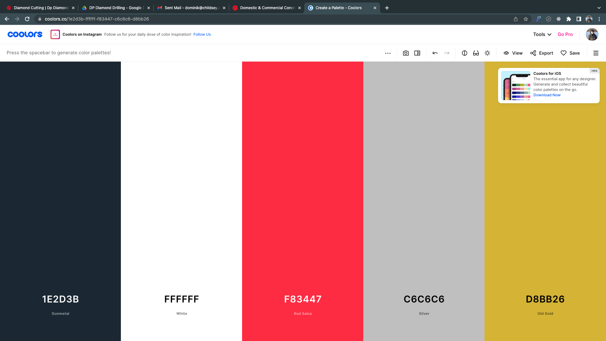

```
07 June, 2022
CodeNation
Web Developer Apprentice
Childsey

Project:
DP Diamond Drilling & Sawing
[http://www.dpdiamonddrilling.co.uk](http://www.dpdiamonddrilling.co.uk)
```

## DP Diamond Drilling & Sawing

### Who Are They?

DP Diamond Drilling is a company based in the midlands who are contracted nationally by
other companies. They specialise in drilling especially with diamond drill bits. The drills they
use are not the average size you may buy at a DIY shop, the drills they refer to are heavy
industrial size and graded equipment, capable of drilling small to large bore holes and also
demolition.

The reason why diamond drill bits are used instead of regular titanium drill bits is because
diamond as an element is one of the toughest materials on earth. This makes them
expensive alongside the nice crystalized formations that they create.

DP Diamond Drilling is used quite a lot around the world due to the efficiency and speed the
cutting can produce. DP Diamond Drilling offer the services as:

1. Fast
2. Precise
3. Cost-Effective
4. Damage Reduction
5. Low Noise Levels

### Competitor Analysis

Almost every business will have some sort of competition. Whether it is having more
services, more locations covered etc, another competitor/rival company will want a piece of
that market. Being part of a marketing and growth agency, we ensure that the client can fit
into the market they want to be in.

Diamond Drilling as a business has been around for a very long time. The first diamond core
drill was invented in 1860.

Other companies will want to advertise their services as well or even better than others and
competitor analysis tells us that the score and rating of the other competitors services. By
doing extensive market research, we were able to find out who sits at the top of the authority
scoreboard and who lies in the middle and bottom. We also found out more information
about the different search terms that are associated with Diamond Drilling and what are the
more common terms that users will search for to take them to their sites.

To gain more authority, we will need to implement a lot of similar terms and keywords to
make sure that users will find what they are looking for on Google or similar engines. This
will all come down to SEO and optimization of the site in terms of content.


#### Concrete Drilling Services LTD


Here is a screenshot of their site. Concrete Drilling Services LTD are a company that will
specialise in diamond drilling and sawing. This company is the top competitor in the market
for diamond drilling. They have higher scores in authority and have a lot more views and
traffic then DP Diamond Drilling.

We have taken a fair bit of inspiration from this site in terms of design and the structure of
the content to try and gain more views, more traffic and optimise all their content in general
to help their business grow. The business may be successful or sufficient, but can always
become better. Google will often mark and assess their content based on what we put into
the site. Duplicate content or overusing certain words, images, meta not up-to-date may
affect the score and this is important.

The difference between DP Diamond Drilling and Concrete Drilling Services is mainly the
design. Both share a lot of similarities in terms of content and structure but design is mainly
different. Both are completely different in terms of wording and the majority of the writing and
text, but are similar in placement and what they are trying to achieve within our SEO.

We took the ‘Areas We Cover’ part of the site and made our own version. This can help to
cover SEO for keywords that people may search for ‘near me’ or by location such as
‘cheshire’. We want to target as many locations as possible as it can be indexed by the
search engines.

##### DESIGN

In terms of designing, looking back at their site, I have very similar icons around the site.
This is purely coincidental due to the fact of me only noticing them later than building the
site. Their site has icons that appear to be matching across all the pages with the stroke of
them being very similar across their site.

For DP Diamond Drilling, we made use of stock elements to get the icons. I have not made
the icons myself as we would be going against the task. The icons I have used across the
site are all made by different individuals. Some designers tend to not have correct icons.
Also, downloading multiple icons can also inspire more design ideas. It is always better to
experiment with more than one design.

Taking stock content is very good as it allows us to make use out of tons of content and
designs ready to put into the site. One main problem is that you would need to get either
business licences such as commercial licencing. This can cost a lot of money usually but
with our package, we can create multiple licences and define who they are for.

The ‘Concrete Drilling’ website uses a very strict colour palette that contrasts around the site.
Taking this into account, I have little imagery that uses the colour scheme apart from the logo
as well as looking back to the original site.


## The Task

### Building The Website

I was granted the opportunity to design and build the DP Diamond Drilling website. I have
run into a number of issues along the way as it was my first time building a site with the tools
supplied.

The website consists of over 21 webpages that can all be accessible with no hidden
gateways or paywalls. The website's main functionality is to display all of the services and
information and to be found through keywords (which I will discuss later) using common
search engine terms and phrases.


The main task was to build the site as fast as possible. Being a part of a marketing agency
means we want to work to deadlines and supply the site as fast as possible to the business.
Being my first site, I was given a fair amount of leeway to make me feel as comfortable as
possible building the site. I was faced with a number of issues and challenges during the
building of the site.


I say over 21 pages as we have a functioning CMS behind the scenes of the website which
adds more pages but the content is pulled through one main layout. This allows for content
to be picked and found using webflows brainy API. This allows for content to be stored
behind the scenes, manipulated later and can be displayed by laying down elements and a
format for the CMS to follow.

The CMS also allows for the creation of web pages that will all follow a design made on one
page called a CMS Template. The layout from this will be carried across the CMS pages and
displayed separately.


#### Colours



Above are the colours used originally by the site. The colours shown are not too suitable for
the site. Making them more prominent and relative to the company might be a better route
for the company. I did not want to wander too far away from the original colours which I
decided to create a palette that sits closer to the company and the original design.


The dark blue previously was replaced with a nice clean jet black. I have noticed more
websites making use of this colour and its almost a cleaner and modern approach to the
colour black.

The red used named ‘Rosso Corsa’ is the main colour of their brand. The logo they provided
was designed by the Owner himself. He made it with the red we see here, I will continue to
use it throughout the site.

We have three shades of white. All three are slightly different colours to each other. These
are here to pop out certain colours and pop out a little bit more. We are using these for the
Header/Navbar and the Footer.

#### User Interaction / Journey

The site is not serving too much purpose other than showcasing certain aspects of the
services they provide. When it comes to journey, the user will land on the homepage which
will display a number of different services and imagery regarding the company and its main
key aspects.

The user can see a number of different call to actions - CTA’s - that will take them through
into different paths of the site. We can also navigate through the site using the top bar which
is CMS driven. Having this bar CMS driven means that when we update the CMS we can
see the changes being made on the navbar making this really easy for anyone who will want
to make amends or updating content.

The main sections of the site are the domestic services page and the commercial section.
These are key features due to;


1. SEO - Search Engine Optimisation
2. Key information shown to potential customers
3. Content & Imagery.

All play a key role in the creation and development of the site. Making sure there is enough
copy and the site is maintained where issues are resolved and fixed within a reasonable
period. Also being able to make the site scalable with Webflow’s CMS.

Scalable means powerful. We are able to introduce scale with a plan within Webflow. The
reason scale is important is because we are able to create tons of blogs, tons of pages tied
into the CMS and a lot of content that can be introduced further down the line. If the site ever
grows massively and needs drastic changes such as a copy, pages, services and coverage,
we are able to do this with ease by accessing the CMS and creating a new service and filling
the correct fields.

The user will be able to navigate the site using the Navbar located at the top of the page and
using the sitemap located at the bottom of the page. Most sites have a footer whereas others
may not. It can be a requirement for SEO in terms of page structure and organisation.
Portfolios can be as creative as they can be to show off skill and coherence with website
creation, especially with developers.

### Original Design

#### The Site We Were Given


The site we were given to make improvements on was in a little bit of a state. There were
things we could make fixes on immediately. Some of the main features and elements around
the main page did not look correct and did not suit the purpose.

One of the major issues with the website was not only was it designed and made in WIX,
there are a couple issues that followed it. We are not able to customise and manipulate the
different breakpoints for specific resolutions accurately. Webflow allows for this to happen as
a feature. Around the site, there are tons of spacing issues that need to be fixed. But there is
just a lot that would need to be fixed. Making and redesigning the site would be an easier
path to take.

The site appears to be following a template of some kind. Research on each of the clients
showcased, one stood out to me and did not appear anywhere else in the content provided. I
looked up the logo and noticed a number of sites with the same logo but they all lead to the
same format and layout as this site.

The main element here was a background image that scrolls with the page. It does work and
it carries all the way to the bottom. The issue with this, some of the blocks around the page
with empty content will be filled with the background image.


Scrolling down further, we could tell some text and margins were fairly tight in terms of being
breathable and scalable. We can see if we were to update the on-page copy to include more
information, we would not be able to include more words, it would look a bit messy in terms
of moving content around and fitting the text around the leftover space.

### The Main Design

#### Inspiration

Starting to design a website from scratch can be fairly tricky. Preemptively I have been
getting myself familiar with some of the tools and also spending a lot of time watching their
guides online about the software. I also studied Graphic Design, by taking in what I have
learnt about UI and UX, it can be really helpful when thinking of an appropriate layout for the
site.

I am a strong believer in rounded corners. It may sound odd but there is science behind the
rounded corners. A lot of sites have now moved over to having more rounded corners within
their content, the same goes for the operating system giant Microsoft with Windows 11.
Rounded corners have a little bit more characteristic than boxes with sharp corners. If we
are designing a UI to have a smooth UX, then we would put our attention to making the
content smooth too.

Having content that is too solid and strict, the animations being blunt and quick, can turn
people away as they may seem as everything is happening too fast. If none of the content
reacts to user input too, this could mislead the user.

I put a fair amount of time into designing the website to make use out of rounded corners
and making anything that the user may hover over, react to the user.


## Creation of the Website

### Webflow

Webflow was the choice of No-Code platform that my employer wanted me to use. The
platform is mainly used due to its simplicity and its way with the CMS system it has.

The platform is very similar to Elementor and WiX as it holds a bunch of tools in the cloud, or
a bricks and clicks platform to some extent. Instead, webflow advertises its platform as
“writing code without writing it”. Yes and No. Yes, we don’t need to physically type to
implement code and make every small change through the HTML file. No, there is no code
seen unless you want it to be seen.

Webflow has designed their platform to be just like the CSS file but with having clickable
buttons to choose between the display blocks, draggable bars to adjust padding and margins
and more. It is all front end designed with a lovely viewport to see what is being changed.


One of the best parts about using Webflow is that it gives us the option to change between
the different breakpoints. Breakpoints are not usually that common to come across on some
web building platforms such as wix. Wix allows you to swap between mobile portrait view
and desktop. There may be some small features that can be enabled to view more but not
that is selected as default. Webflow has multiple options to choose from such as higher
resolutions all the way down to mobile portrait. We even have the option to edit the layout of
the mobile landscape. Webflows API will be writing the code in the background depending
on the variables we change in the designer. Every change we make on the higher breakpoint
will scale down automatically to the lower resolutions. If we were to change the layout on mobile, we won't see the change being made on higher resolutions as the hierarchy of the
breakpoints restricts that.

### Meta Data

Metadata is a very important part of web building and SEO. The data is crucial and is the
first place you would need to start when trying to improve the site's authority score.

_“What is Metadata? Simply put, metadata is data about data. With Search engines,
such as Google, do not "read" your content (data.) They index by seeking out
information from defined metadata fields.” -_ (ALA)

Metadata would be made to be behind each page. This is data about data that will
be read first by the search engines and will increase our SEO authority. All pages will
require metadata being added to ensure all the keywords and phrases can be
indexed.

We have 2 kinds of metadata in each page and it's all important and required. We
could however change how it looks but it is recommended that we follow specific
rules and guidelines to ensure that we are being searched and meeting user search
criteria.


Here is a sheet of keywords and meta that our team has provided me with. This helps me
understand what SEO and meta content needs adding in on what page. It is also very
important what content is placed onto which


#### Title Tags

Title tags are used to structure the site in terms of how it looks in a search engine. The
structure is not strict but being shown off in a specific way will increase SEO and authority. A
lot of websites will follow the same structure.

The Page The User Wants To See | Company Name
Or
The Page | Exciting Keywords And Phrases | Company Name

Domestic & Commercial Concrete Drilling Services | DP Diamond Drilling & Sawing
Commercial | Concrete Drilling & Sawing Services | DP Diamond

#### Meta Description

Meta description is a way of adding keywords and phrases into a descriptive box that will be
indexed by Google’s search engine. The main goal for this is to match the users search
queries with what lies in the meta description. No one can view the SEO behind the site as it
is usually a trade secret.

_Domestic & commercial concrete drilling specialists with over 50 years experience. We offer
cost effective drilling, sawing & grinding solutions across the country including London & the
North West._

Here is the main page meta description. We are targeting a lot here by adding in relevant
keywords and phrases to match user queries.

### The CMS

The CMS stands for Content Management System. Most platforms use these to add content
in from other platforms or have them alongside an application. Ecommerce sites especially
make extensive use out of CMS as it allows for Stock Control, Sales, Tracking and much
much more. It's not only for ecommerce but, we can use the same system to add content in
certain areas.

Webflows CMS allows us to make ecommerce sites with ease with its CMS capabilities. But
we have not made a site, why is it relevant for my use? Webflow has designed their CMS to
be able to import content such as text, dates and general information and data and show it
on a page.

For example, I can design a CMS collection such as a table in a database. We can design it
with the parameters and have references to other collections if we want that data being used
over the site. The collection will hold a Title, Date and a Description. By creating the
collection, Webflow creates a CMS page template which we can start designing. We can add
all kinds of information. Upon creating a CMS Collection, we are able to use collection lists
within our standard pages to retrieve that information stored and we can have it displayed
how we want it.


With CMS Page Templates, we are able to achieve almost the same functionality but all the
content is swapped on the same page but the layout will be replaced with the content. We
can make the one page and have all different content showing on different events. I can
have a button linked to the CMS which will correlate to that specific CMS page, and it will
redirect me to the template page showing relevant information stored for that particular
collection.


We can also achieve a lot more with the CMS, it does provide some new functionality later
being released which allows for memberships. This can be very handy for making pages
accessible through certain user accounts and also being able to lock content through the
memberships entirely.

With the CMS we can also integrate new features such as approved third-party software. We
have used tools such as AirTable which is an online database for storing data and pulling it
through the CMS. This can be extremely useful as we can have a more complicated
application that may need developing such as registration, progression and this can be really
useful with membership run websites. Using AirTable we can expand how much data can be
pulled through and also integrate that with other technologies making it better and efficient.
AirTable is a cloud based database. It is a lot more secure and is maintained 24/7. We have
no need to integrate AirTable but this can really show how powerful the CMS can be through
Webflow.

There is a slight downside to the CMS. Depending on the package/plan you subscribe to
with Webflow, you will always hit a 10,000 collection item limit which is not ideal for Job
board applications and large scale Ecommerce sites. Yet 10,000 seems a lot right? It all
comes down to scalability when creating a website. Depending on the projects, we choose
the correct tools for the job. In our case with DP Diamond Drilling, we will never reach the
10,000 limit due to the scale of the business not requiring that much information in the CMS.


There is a ton to talk about when it comes to the CMS but we really cannot talk about how
useful it can be for all purposes. We are able to make eCommerce sites with ease by
dragging and dropping elements into the viewport/canvas to show elements such as items,
images, links, pricing etc. This can be really useful. For DP Diamond Drilling, this will not be
useful. Everything that the company can achieve needs discussing over the phone or emails
rather than buying the services as the majority of their work is more bespoke and can differ
in cost and equipment.

### FlowBase

Flowbase is a templating tool that makes designing and creating perfect layouts and also
exploring new designs when in Webflow. It runs as its own website where you can sign up
for a fee per month and you are given fresh designs to incorporate into your design. I have
made extensive use of this tool as it inspires me to work around the design and to be a bit
more creative.

FlowBase is a tool when it comes to creating websites with speed and style. All we need to
do is copy and paste the layouts and then make the changes in Webflow to fit our purpose.
We are not limited to what we can add into our work using FlowBase but it helps push
design further.

Layouts are a thing that already exists in Webflow but sometimes they just are not enough.
We are given a fair amount of designs to use and make changes within Webflow but
FlowBase shows off nice new designs that can be changed on the fly. The styling is there
and just the content needs to be changed. They provide nice placeholders for imagery and
also showcase a range of layouts fit for any purpose.

Apart from layouts, they do showcase a range of formats for Forms and Testimonial features
that can be incorporated into our workflow.


### Google Analytics

GA is a plugin that we can incorporate into our websites at any point in time. Ideally when
the site is fully ready to launch. We can use google analytics to find out any issues by
tracking the response times on certain pages, we can also incorporate it to find out where
our users are coming from and going to next. This is very handy for capturing data generally
on the site.

To enable google analytics we would need to create an account on GA to be able to start the
tagging process. Creating an account under our main account means that the tagging will
not interfere with any other accounts that have been made under the main. We are able to
select the website under our sites to view the dashboard.

Standard features that are usually on GA are tracking certain events and we can also create
our own. GA is a very powerful tool when it comes to studying user data and helps marketing
by understanding where users spend their time on the site more and where to place more
relevant content on the site.

If we have a user group that stays on one page longer than usual and it happens more often,
we could start adding more to that page that will allow them to get in touch. We can improve
the functionality across the site to reach out to find more. This can also be a great method
for capturing user interaction and retention on a page. During certain seasons in a year, we
may add deals or offers or target specific drilling techniques that may be more suitable
during the certain times. We are able to advertise this later down the line. Also, we are able
to display certain pop-ups around the site that will try to engage a user if they spend enough
time on a page to trigger a modal. This could help the user get in touch with the company
and we can track if people are using the modal or not.

Because GA is a huge platform for marketing, we are able to track new users and returning
users. The way I believe google works with this is by tracking devices and tracking google
accounts. Almost everyone who uses Google's services requires a Google Account. We are
able to capture new users on the site or customers who may require another service.

This is an example of the GA snippet that would sit directly after the `<head>` tag on every
page. We would need to set up an environment/account on GA bound to receive data from
the site from the tag. We would link something like this in order to transmit data. Wordpress
does this in a better fashion by using their Google Site Kit tools which easily set it up for you.

```jsx title="/src/components/GoogleTracking.js"

<!-- Google tag (gtag.js) -->
<script async
src="https://www.googletagmanager.com/gtag/js?id=GA_TRACKING_ID"></scrip
t>
window.dataLayer =window.dataLayer || [];
function gtag(){window.dataLayer.push(arguments);}
gtag('js', new Date());
</script>

```

```jsx title="/src/components/GoogleTrackingSnippet.js"

gtag('config', 'GA_TRACKING_ID'); <!-- GA_XXXXXXX -->

```

## Coding

### No-Code VS Code

No-Code is the way to go for modern website building tools. Sites like WiX, Webflow and
Site123 are designed to be almost effortless in terms of building a solid site with a structure.
No-Code does not entirely mean No-Code prominent, there are some aspects of code
behind the scenes that function in order to make the site work and be built. Sites like
webflow are web designing platforms that are usually made with a language such as jQuery
which makes all the magic happen front end wise.

However, there is still code being used in these platforms. Especially with Webflow, we are
able to export all the code the site has made for us to a file along with all the assets and files
necessary along with the CSS HTML and JS files. The reason for this is that we may need to
use another web hosting platform such as Atlassian, WHUK and GoDaddy. These platforms
are some of the more popular ones and all the prices vary. Majority of the hosting platforms
have the ability to login to a portal that will allow the user to upload all their files and assets
directly and the site will pick them up naturally.

Code can also be used and manipulated even when exported. We are able to edit the code
in any way, shape or form. This can be very good for experienced programmers as they are
able to add in custom content whether it is scripts, tagging up the content with programs
such as Google Analytics.

#### Webflow & Code


Building the site was entirely designed in webflow which had no need or the necessity of
touching any code that the platform created for us. Any custom code can be implemented if
we were to export it and we are able
to add our own code in the editor
using the page settings. We are able
to add before and after the ‘body’ and
‘header’ tags which can be good for
adding small scripts.

Everything that can be accomplished
using code can be done through the
webflow front-end. We are able to
play with common elements, change
the styling and also add animations.


## SEO

### What is SEO?

SEO stands for ‘Search Engine Optimization’. SEO is a marketing strategy to get more clicks
and searches at the top of search engines such as Google or Bing.

SEO is often rated on the content, spelling and grammar on a site, the structure and usage
of keywords. We use a tool called SEMRush to determine and also help us gain better web
authority to have higher rankings on search engines.

“Your website's authority score predicts how wella domain will rank.
SEMrush's Authority Score is measured on a logarithmic scale of 1 to 100,
and a higher number means more traffic and better ranking. A low number
may cause decreased traffic and ranking.” -(SEMRush)

Every website that has been marketed or has had a team behind it to design and maintain
the site will have had to put time in to implement a method to gain more customers or traffic
generally. SEO will be the main reason for this. Everyone ideally would like to see their site
on the first page of Google after searching and that is where SEO comes into play.

By optimising content on each of the pages, we can target certain audiences using designed
content. For example, the DP Diamond Drilling site will have targeted content. As the
company offers their services across the majority of England, we are able to target certain
people searching for ‘diamond drilling north west’. We have dedicated optimised pages to
target these people. All the locations the company can cover, we have certain pages with
content made for the search terms and keywords people will be searching for.

### Why is SEO Important For Us?

SEO is very important for any company who wants a simple way to market their product/site
online. Google offers Ad services to put your site featured at the top of the search results.
We want to optimise all the content as much as possible to fill any gaps that could gain us
more traffic or more customers.

Content needs to relate and also make sense to rank it as optimised. Keywords and phrases
will increase the authority score. The same will go for ‘Meta’ tags and also ‘Meta Description’
and also ‘Meta Title’ points in a website. Doing some research on how to make a google title
or site structure, having the page title/name or H1 tag first then dividing with ‘|’ symbol and
having the section name, dividing again then having the site name seems to be the more
common method of designing a structure or page names for search engines to follow and
pick up.

Generally, making all the content relative to the topic, making extensive use of keywords and
phrases. Adding Meta tags and filling in all empty blocks when designing. Alt text as well
filled in can also increase authority.


## The Website

### Landing Page / Home

The landing page is broken down into 3 main sections that are all targeting SEO. The page

has certain keywords and terms that all aim to gain a higher score for authority.

The top of the page has 2 anchors that will link to these sections in the middle of the page
(the image above). The buttons are anchors that link to the commercial section and a
domestic section.

The middle section of the site homes the content regarding the domestic drilling services and
also the commercial drilling services. These also have links to separate pages that will also
house the content we have designed for the site.

The lower section of the site houses the testimonials section and also the footer section
which is standard on sites. The testimonials section has some ratings and some comments
happy customers have made about their services. The footer has some information about
the site also, the site map to navigate faster around the site and also the roundall which is
shown off as an award.


### Case Studies

Designing the case studies was a blast. I made use of the flowbase tool to be a little bit more
flexible with the design. We have each of the case studies on the right hand side that scroll
down. The design is using the CMS and each study has its own container with a read more
button.

Designing it a little bit further, added a hover action that just interacts with the user. Just part
of UX and small feedback to show that they can interact with the section.

The section on the left would scroll with the page but there is a lot of writing that goes off the
screen unless hitting the bottom of the scroll. After some feedback, I have decided not to
have the scrolling effect in place as it restricts the user from reading.

You are probably wondering why I cannot resize the text or use a tighter font? This will affect
SEO and the optimization of content. Everything needs to be a certain size across the site.
This goes for headings, paragraphs and general text.


### Areas We Cover

This part of the site is designed to target certain keywords being picked up by the search
engines. This is all run from the CMS to display the content on screen. We have a CMS
content list that will be sitting in a container to display all the locations there as names.

On top of that, we have a CMS page template that will display certain content relating to the
buttons above.

These pages are designed to be used for people looking up diamond drilling in a specific
area matching above. These specific pages could show the main page. These pages have
been made to have the ‘Meta’ adjusted and the text to be optimised for indexing by Google.


### Drilling Down / Blog

These are different blogs we can showcase on the site. We have 2 CMS collections working
alongside each other here. We have all the blogs stored in one separate collection which will
be used to show all the blogs off. The collection lists will pull the CMS items and display the
information. The second CMS list is called categories and will allow us to make use of the
referencing feature the CMS has. We can use multi reference to have content sectioned as
we have done.

Within categories, we have 3 separate items just being items, nothing in them regarding
content but only containing names. We can fill them full of information as well if we want to
change how the blog looks. Right now we have the ability to filter the content shown in the
collection list. We have a filter that will look at Categories and will contain the latest news.


### Domestic Services / Wall Hole Drilling

Wall Hole Drilling is one of a few sub-pages designed using the CMS. We can use the CMS
to make text show where we define the blocks across the page. Using the CMS, we have
designed a few other pages that will run through the CMS which can be selected in the
dropdown. We also designed the pages to be a little bit different from the commercial side of
things just to separate them and make them more identifiable.

At the bottom of the page, we can also view how there are buttons that will take you to the
corresponding pages. This is useful as it enhances the user experience drastically. It is a
nice feature to have but also proves just by hovering over the elements, we can click them to
take us somewhere.


## Testing

### What Is Testing?

Well, testing is common for any application whether it is building an actual application or a
website or anything else that is being released to the public. Testing ensures that our hard
work pays off by making sure that we don’t have any issues with the website or bugs that
could resolve in not having a functioning website.

In our case, testing would mean that we make sure that the website runs and is optimised.
This could be testing how long it takes to get from one page to another with response times.
We could figure out what causes these issues to occur by looking at the more resource
heavy components on the website. These could be images that have a large resolution or
tons of requests or slow server speeds.

#### Email Testing - Overall #1

We have finished the main design of the site at this stage but we need to gain feedback from
the client to make sure he is happy with the site, looking for any issues as they will know a
lot more than us about what they do, how they do it and all the methods following. To be on
the same boat, we simply emailed the client to make sure they are happy with the site.
Giving them an approximate deadline and requesting anything they would like to see on the
site.


After releasing a test phase of our site to gain some feedback from the client, we were able
to find some bits of information that needed to be amended such as their clients list. We
pulled some data from their original site such as imagery and information regarding work that
they have previously done. Making the fixes were very straightforward and simple.

Being the designer for this site, I understand that the CMS links to the client ticker that will
resemble a constant moving carousel. This is a nice and creative way to showcase imagery
and text, especially clients as it catches the attention of the user more than plain text.

—

As we head into our CMS collection, we are greeted with all the clients that I have added in
prior to the change. We are able to edit and manipulate any of the fields alongside the client
to update it anywhere on the site where it is being pulled from. CMS is very similar to a
component based web-application. We can look at a react app in the same way as a
Webflow CMS Template will have its layout stay consistent but the contents will change
making it seamless.

Website CMS is extremely beneficial for blogs and websites that require news being
showcased. By building a blog, we can apply new fields such as time and date, rich text
fields and more and customise the pages how we want. CMS is very versatile and should be
used wherever and whenever.

—

#### Peer Feedback #2 - Landing Page

At work, I have a few colleagues that I can rely on to
provide me with good, reliable feedback in which I can
understand and translate to fixing the issue. One of the
issues that was brought up was the case of using huge
margins. In my case, nothing was wrong with using them
as I was trying to compensate for other parts being out of
order but I was going about it the wrong way.

I had margins that were 1000 pixels in length and some
of them were -1000 pixels as well. At the time I knew
what I was doing but it makes it very unreadable and


hard to pass over to my colleagues if they need to make changes.

The content on the page was all reverted back to 0 margins to try and fix this issue. After
reverting back to 0, I started re-arranging content around the pages such as the structure.
This would be the HTML side of the site.

The viewport would show it off as a nice grey panel called ‘Layout’ that would be used to
show the site structure in terms of Div Blocks, Sections, Containers, Text-boxes all in
hierarchy. If a Text Box was in a Container, the container would have a dropdown menu next
to it to show you what lies within it.

—

#### Mobile Testing #3 - Overall


It is very important that we test for mobile and other breakpoints across the site. This can
affect how the page is viewed across all devices. When we design for one breakpoint we are
essentially designing it for that specific breakpoint as well. Luckily, the content drops down
into the other breakpoints for us to configure and design much better.

For other more complicated structures, it can be difficult to make changes for. We cannot
also remove content as well, but we can hide content using the ‘hidden’ attribute.

Another main aspect of having breakpoints that drop down into mobile is the drop-down
menu we have that replaces the header navbar. This will automatically change if the device
is recognised and the resolution is smaller than the larger breakpoint. Breakpoints work in a
downwards fashion, we can make changes on a larger breakpoint such as a monitor with a


resolution of 1920*1080 and we would see changes carried on the mobile. If we were to
make changes on a mobile device or resolution, the changes will not be carried upwards to
the large breakpoints. This is useful as we want to secure our changes and not expect
anything to be altered on our larger displays.

Breakpoint testing can be tedious but is crucial for any sort of web development that requires
attention to the mobile side of the site. As we can see on the screen capture above, we can
visually see an error. This error is just a sizing error and is not too difficult to rectify.

—

#### CMS Page Testing #4 - All CMS Content


CMS content is never often second glanced at. The issue is not shown above as it is not
clear to see visually. Content that goes into the CMS will come out exactly as it will come
out. Defining text boxes such as headings and paragraphs, we will add the content in as
needed and if it looks great we will move onto the next task. However, realisation can tell us
that the content is right, but the elements are wrong. This might seem a little confusing.

At the top of the screenshot, we have a Title, “Diamond Drilling Project”. This title is being
pulled from the CMS but is also in an incorrect heading tag. The element it sits in is a H2
Heading box when it should be a H1 Heading box. This is purely an SEO quality check but
content like this may be across the site, going through the site and making all the changes
necessary seemed like the correct approach.

Yet it does not look bad from the screenshot, it will impact other areas of the site such as our
SEO which is the main point of the site. The site is to gain attraction and gain organic traffic


from search engines and find new users and generally people who are looking for diamond
drilling services. If the content is in, that is not a problem but it will need to sit in the correct
elements across the site.

### Maintaining The Site

After testing comes maintenance. We want to make sure the site does not change and the
main elements can be put into place without having much of an impact on the site. Primarily
we are using the CMS to allow for the creation of new content to be added directly into the
site and this is one of the main reasons why we use it. It is versatile and functional at the
same time.

If we were to make and add new blogs to the site, it is all created through the CMS and is
added directly to the front-end of the site upon publishing. The same goes for the case
studies that are featured on the site, and the services. This is one of the direct methods we
would use if we were to make amends to the site. Checking if we can add it through the
CMS or if it needs to be to each of the pages individually.

Aswell, it is really important for our business to keep in touch with the client at least once a
month to catch up with them about the changes we will be making and if it works for them as
well. We will also show them possible design tweaks and changes in the site or how it could
look before making changes if possible, this is usually the case if we were to make large
changes.

Keeping in touch via email and also having 1-to-1 meetings with them over Google Meetings
allows for a more confrontational meeting to discuss anything they would like to see added
or removed from the work we have done for them. The ability to screen share as well is very
important as we can talk about key areas within our work that we want to highlight and show
off that is major to us and them and to talk about why we made the changes.


## Conclusion

## Denouement

The project was really great. I enjoyed building the site. I definitely learned a lot whilst
developing this site. I hope it does need content changing and moving around in the future or
having the ability to incorporate more functionality to the page, live chats etc.

There was a huge push for time whilst making the site and it would have been the first site I
have ever made with Webflow and it was a real test. I have made some issues and I can
notice them as I go across the site. Some elements and current functionality have been
removed due to site performance but hopefully they will make a return.

One major issue I was running into were the margins. I have used excessive amounts of
margins just to position content correctly on the screen. I would not have been doing it the
right way because I was using -900px margins +1000px margins that can sometimes be
annoying if someone is to work on it. Readability would have been an issue. I have managed
to fix this after a little help with reverting everything back to 0px and making the appropriate
changes later down the line.

Scalability of the site is even. It would not be too difficult to incorporate new content onto the
site but I would need to make more room and make it more suitable for collection lists to be
able to fit across the site.

In terms of custom code into the site, it is not really achievable in terms of webflows
functionality and what we want to achieve as a company. The site could have some custom
code if it were to be run across onto a web host. Webflow has its own web hosting solution
as it is quick and easy to make the changes from staging to the published site. For the type
of site it is and it is mainly to advertise their services and also hold information on all the
case studies etc, it would not seem necessary to implement anything custom in.

The only thing that would be custom were to be the Embeds, Google Analytics and other
tracking tools such as Hotjar. We can implement code snippets into the body and headers of
each page.

Hotjar’s code comes pre-made to fit into your site. Works very similarly to GA.

```
<!-- Hotjar Tracking Code for https://www.dpdiamonddrilling.co.uk/ -->
<script>
(function(h,o,t,j,a,r){
h.hj=h.hj||function(){(h.hj.q=h.hj.q||[]).push(arguments)};
h._hjSettings={hjid: xxxxxxx ,hjsv: 6 };
a=o.getElementsByTagName('head')[ 0 ];
r=o.createElement('script');r.async= 1 ;
```

```
r.src=t+h._hjSettings.hjid+j+h._hjSettings.hjsv;
a.appendChild(r);
})(window,document,'https://static.hotjar.com/c/hotjar-','.js?sv=');
</script>
```
Another example that we could use is to incorporate an embed. We use these to add
functions that we cannot use through the web.

```
<div class="mapouter"><div class="gmap_canvas"><iframe width="600"
height="500" id="gmap_canvas"
src="https://maps.google.com/maps?q=2880%20Broadway,%20New%20York&t=&z=1
3&ie=UTF8&iwloc=&output=embed" frameborder="0" scrolling="no"
marginheight="0" marginwidth="0"></iframe><a
href="https://123movies-a.com"></a><br><style>.mapouter{position:relativ
e;text-align:right;height:500px;width:600px;}</style><a
href="https://www.embedgooglemap.net"></a><style>.gmap_canvas
{overflow:hidden;background:none!important;height:500px;width:600px;}</s
tyle></div></div>
```
We had a map function in place but the client requested that we were to not advertise where
the company is based. This may change later down the line. I know and understand how to
implement the map feature into the site.

We also have exclusive use of a system called typeforms which is a more interactive system
for developing forms to capture data whether it is data being stored or just gaining feedback
from something. Using typeforms, we can make a questionnaire to get in contact with the
company or just to make a query. Typeforms are not only stylish but are also a powerful tool
for routing through forms. We can set up multiple endings depending on the questions and
answers.

## Overall

The task was great. I do want to continue to work on it whether it's adding new features or
content on. Timing needs to be worked on as it did take me little over 2 weeks to complete. I
have no prior experience creating websites in Webflow and I do want to work with more
clients to build up my experience.

Hopefully I will be able to incorporate custom code that could be used throughout the site
that could either be of use to our company or to help DP Diamond Drilling.