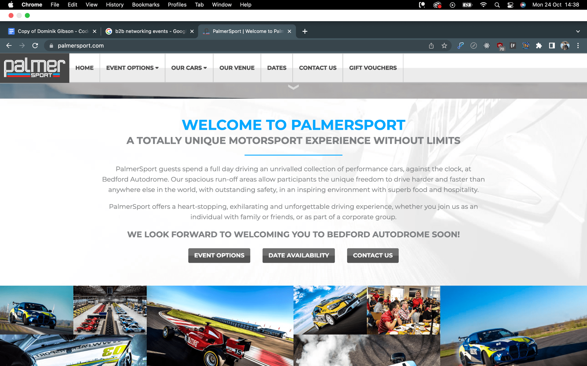
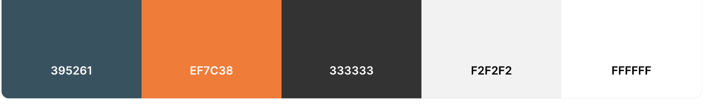
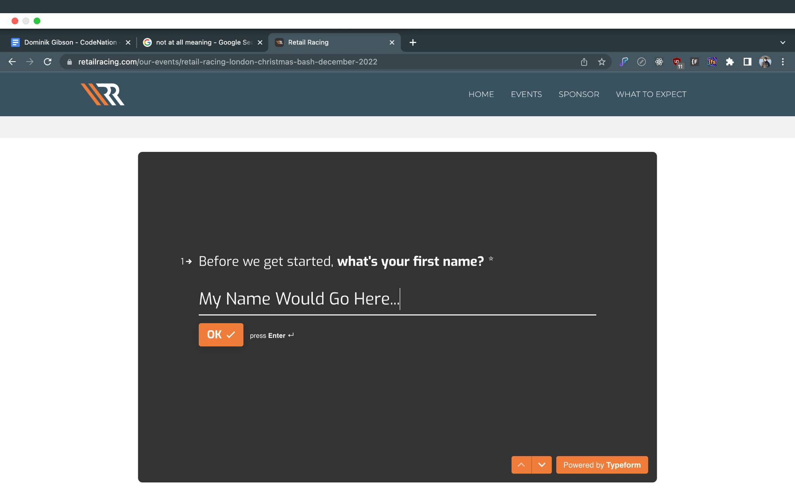
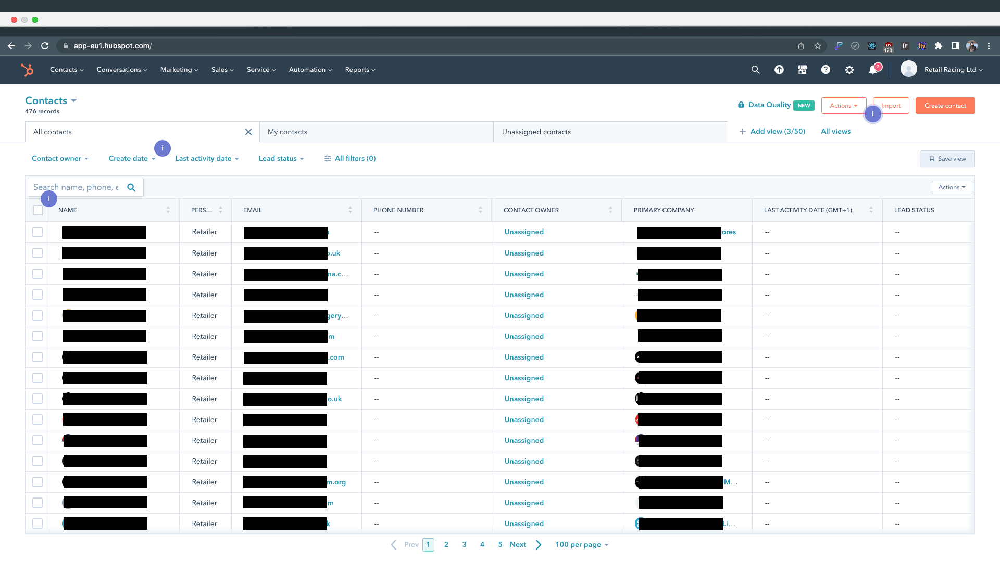
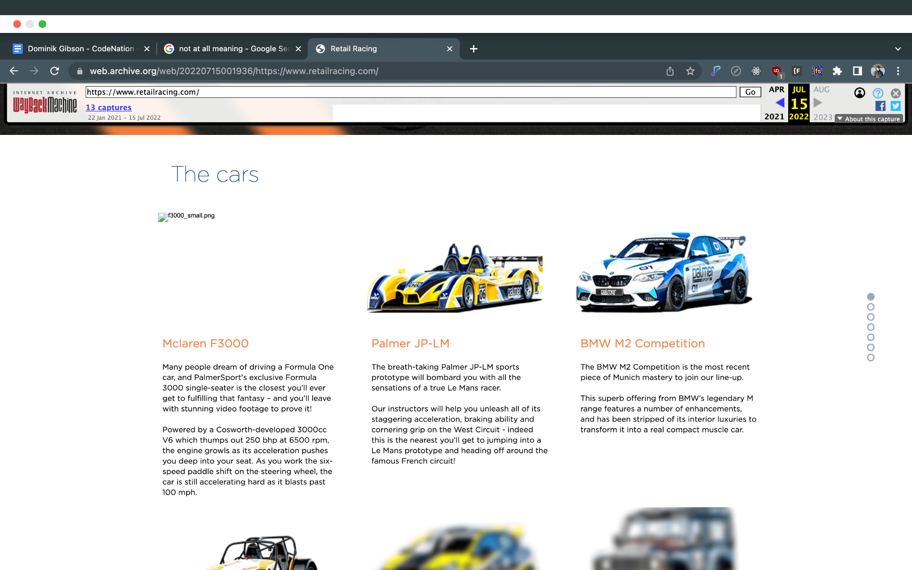
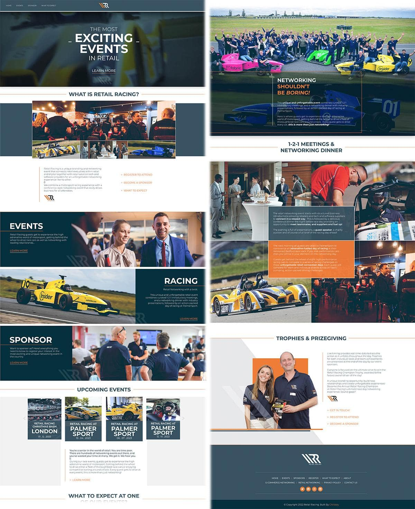
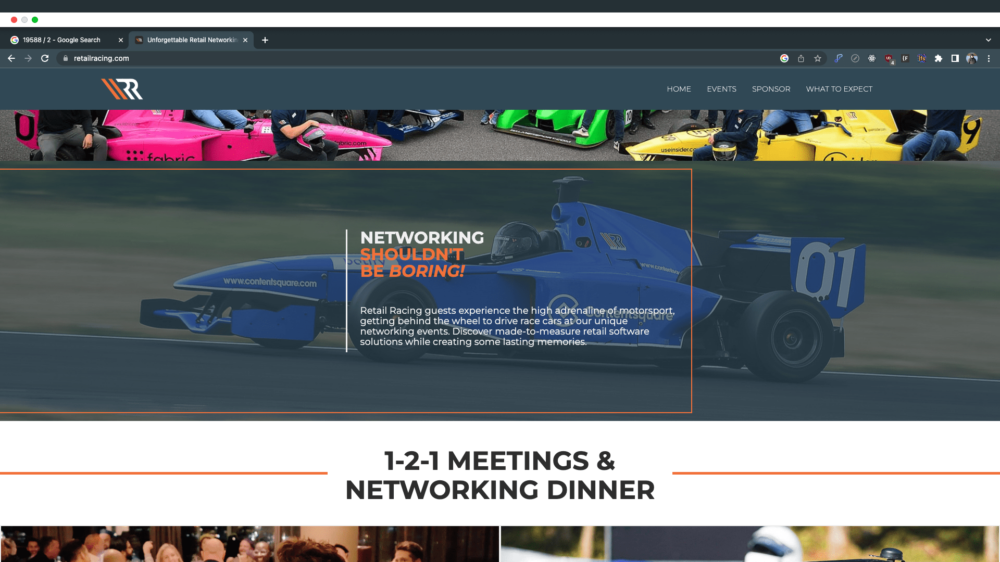
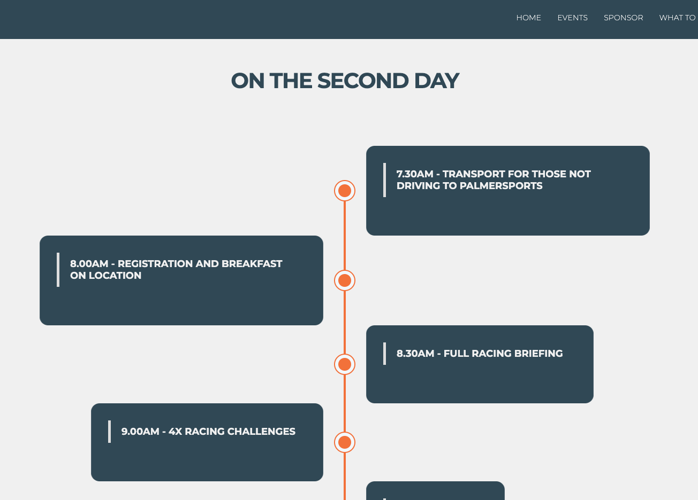

```
Dominik Gibson
24 Aug 2022
CodeNation
Web Developer Apprentice
Childsey

Project:
Retail Racing 2022 Website
https://www.retailracing.co.uk/
```

## Retail Racing

### Who Are They?

Retail Racing is an event organiser for racing events which enable retailers specifically to
network lavishly through exciting events and also be greeted and treated to nice food and
accommodation. Networking allows these retailers to connect in a new and exciting way.
They will host these events all over the country and sometimes internationally depending on
the type of event.

### Competitor Analysis

In terms of the style of the event, It is very bespoke and has not been done before on the
scale of the event. Retail Racing work closely with another business named PalmerSport
which runs its own event hosted at Bedfordshire Autodrome. This autodrome is a track which
is 4.2 Miles long.

PalmerSport is not a competitor but has its own facilities and an event that is used by Retail
Racing.

The website is built on the event and advertises the cars all over the website. PalmerSport
grants Retail Racing their cars to use throughout the day. A lot of the content is very similar
in terms of the styling as they work so closely together. Yet with such similar design but both
unique in their own way.



## The Task

### Building The Website

Taking the initial feedback from the kick-off meeting, we needed a fresh idea for the design.
This meant that we did not want to copy the PalmerSport design but make something that is
just as sporty in terms of racing.

Their original website was somewhat very similar to the recent design.


#### Colours



The colour choice for the site was to carry on with the original design that their current site
was using such as the blue above and the orange. Taking into account the sporty nature of
the logo they have as well. Recreating the design with the colours was not at times difficult.

#### User Interaction / Journey

The user journey of the site is straight forward. The main topic of the site is the Index /
Homepage which is where the user will land on. The page is littered with CTA’s and buttons
that the user can click on to take them to either the Sponsor page or the Register page.

An important part of the landing page is that the user will be able to view upcoming events
on the homepage. This is possible with the CMS. We are able to make these changes and
display certain data for the homepage. By using the CMS we are able to change the
information displayed on the homepage as well and have multiple kinds of information
shown too. For example, we have currently got the CMS setup in the way of showing just the
name of the event and the date along with an image. We could also include the types of cars
shown on the event card and also the tree of what happens on each day.

The journey will be to create leads for the site. We are mainly getting people who are
generally interested in the event to register as a Sponsor or as a Guest.

For this we have designed 3 Typeforms which are a modern alternative to having forms on a
site. These forms allow us to integrate with the current technologies their business already
uses such as a hubspot.

We have 3 Forms due to the reason of having a Sponsor form, this is to capture any data
from a sponsor that is interested in the event and may want to get involved.

2 Forms are designed for capturing guests. These guests are captured through the forms.
They are taken through an approximate 1 min journey where all relevant information is
asked and collected. These forms are also built with Hidden fields so that we can identify
that the forms are going to automatically be tagged as Sponsors or Vendors.



The Typeforms offer a nice flow as well as they are used on more modern designed sites.
We are using them to capture as much information as we can and that the Retail Racing
team requires. We are able link our typeform to the hubspot we have access to to make the
relevant changes and start populating the contact sheets accordingly. With Typeform, the
integration is as simple as clicking a button and linking the relevant form fields to the fields
within the CRM. This enables us to view everyone who has signed up to be all in one place.
This also allows us to view all the fields that have been created on each contact.

With the capabilities of Hubspot, we can also make changes to the data that is displayed. If a
user were to enter the form with incorrect information, another form submission will update
the contact information accordingly.



Hubspot is declared to be a leading CRM software. This is useful for their business as they
want to collect as much information from their customers and collect relevant information
that they might need for the Retail Racing events. We have got information such as dietary


information which can be extremely important. Along with this, they can collect what events
the individuals who signed up for have chosen and if they are a Retailer or Vendor for the
said events.

Every page across the site has its own content for specific reasons. We have some pages
across the site targeting SEO and authority around keywording. There are 2 pages in
particular which target SEO which are a copy about Retail Networking and Ecommerce
Networking. These 2 pages are built around the keywords that are often search terms for
networking and retail events. Not only that but as well keywords targeting racing.

The events page will display a range of different events that have been set up on the site.
We have full customisation of the events through the CMS and this will allow us to customise
the dates, the event completely and what happens on each day. We have full control over
the styling over each of the events as we are using the CMS to create each page through
the template.


### Original Design



Here we can see a screenshot of the previous site. This is presented from the Wayback
Machine. Unfortunately due to the circumstances of the previous site, I was unable to grab
screen captures of the imagery as such but I am able to talk about the generic structure of
the site.

The main feature we can see on the top of the page is the header which has an image for
the background on the slider, as well with quotes on-top. The main issue when we were
assessing the site was to point this main issue out and we were going to fix the issue as it
would be the first issue a user would see when viewing the site. The main issue here is that
the slides seem to overlap somehow. Unfortunately I would not know what would be causing
this as I have access to how the page was developed and created. From my knowledge, the
issue could be a sort of slider overlapping issue which is having the image and the slider
being relayed twice which is causing the issue. We are able to see 2 sets of swipe / next
arrows which is causing an issue.


Scrolling further down the site we are able to see another change that we amended which is
the cars. The Wayback Machine seems to blur out some of the content as the images on the
site are the more storage heavy assets on the site. We are able to see what they are and
what is supposed to be there. On the main design we remove this as there are a ton of
images across the site showcasing the racing and the cars. However, we used this feature
within the events themselves.


Another main aspect of the original design was the sponsors. We removed all these features
and moved them around the site. Taking the sponsors as well as one of the main features of
the site, we have a dedicated page that showcases all the sponsors that are more relevant
to the events. This is because we do not want to clutter the main page and have all the
relevant information on specific pages. This is so that SEO can work its magic and we have
a solid organisation of the content across the site.

### The Main Design

#### Inspiration

Inspiration came through the sporty nature of sites that prexist. I initially thought about giving
the site a fresh look with new colours sticking to the logo. I took inspiration from the logo too
which gave me a strict design outlook on what to achieve.


The logo as we can see shown above, has a unique design and really stands out to me
especially. The diagonal lines describe to me a sharp engineered take on how the
automotive industry builds its cars with precision and really shines through the logo. As well
the orange outlines the boundaries of the track as well where the white is being portrayed as
the track.

I also see how the rounded shapes on the RR’s are very similar to the guides on a racing
seat within a sports car. These keep the driver bolstered to the seat and limits head
movement. The limited head movement will protect the head in case of an accident so the
logo could promote this aspect of racing too.

Apart from the logo covering the site in terms of design. I wanted a fresh look. I started with
the initial thought of using rounded corners with all the blocks. The site looks sporty and fast
as the content is smooth and flows. We were given very nice feedback from the design apart
from it being more basic.

Basic is a two sided story when it comes to design work for websites. One site that I often
refer to in terms of simplicity is the Cloudfare’s 1.1.1.1 site.https://1.1.1.1/. This site is very
basic and has very little features being shown. It only shows what is needed and is not too
complicated with the structure of the content.

However, the feedback we were also given was to build the site with a feel around the
networking side of the event. Making it sporty was a very good idea and I was pleased with
the outcome and the client was happy as well.

Rushing to get some initial designs through from our designer. I had a few days to redesign
the entire website from page to page. This was very stressful as it was trying to get the entire
site changed over, showcasing any small changes that we have made whenever we were in
a meeting.



Another major piece of feedback which could have affected the entire building of the new
design was a comment about changing the entire design and feel of the website. This
shocked the team as we did not know how to approach the site after it but we kept working
on the new design as we had more room for improvement and it allowed us to be more
creative with the design.

My initial thoughts towards the feedback were to see which pages that the client would need
to see the changes the most on before making any other changes towards the website.
Adapting the new design was a challenge as well due to the nature of the design. Some bits
looked very difficult to achieve and by getting some aspects correct or almost near perfect, It
was done by trial and error.



A challenge I encountered is shown above. Creating a thin orange line across ⅔ of the full
width of the image behind.

I managed to create this by using a 66% width on a div block that has no fill but has a border
on the top, bottom and right sides.

Making the width around 5px, changing the colour to orange. As well creating a grid
beforehand for the content to sit.

The grid is 100% width and divided into three blocks which aligns the content centre as well.
In the grid we have 3 div blocks in each section.

The middle block has a text box within and the text box is relative to the text inside.

Adding a small amount of padding to the left side created the space between the white
border and the text that is sat in the box.

Aligning the content as well with the centre box was not too difficult. By making it the grid
method allowed for the versatility we needed across all the breakpoints.


## Testing

Testing was made possible by communicating with the team. Certain elements of the site
were constantly being tested and this is part of the design lifecycle process of the site.
Having to test the site through every change is challenging and time consuming depending
on the part that needs to be amended.

#### #1 MOBILE - DISPLAY ABSOLUTE ISSUE

The display attribute ABSOLUTE allows for content and other elements to be moved around
and positioned more freely to a page in relation to the layout and the stacking on the page.
Absolute positioning will make the element stay on top of the majority of the content if not
already defined by the Z-Index. This allows for more versatile movement.

The issue we faced when using absolute positioning is that an element was off centre to the
content and needed the absolute positioning to be able to be placed relative to the content
above it and underneath it. Relative positioning would give us a different result as it would
layer the content as such as the layout hierarchy would be. This is how it would be made in
the HTML. The CSS or the Style tags would allow us to customise the Z-Index as well as the
positioning.

With mobile devices, content like this would need to be altered as such to make the content
and div block elements fit responsively to the resolution. Using a flex layout would allow us
to move the element lower and stack the content accordingly. This made the content more
suitable for positioning across smaller screens.

#### #2 GLOBAL - SPACING

Spacing is important across the site. Not only does it look nice but having too little spacing or
too much can make the site look different all together. It is more professional for sites to
have an even finish when it comes to spacing across the site. The correct reason is that it
allows for content to be easily read and allows for the smooth transition between two
sections on a page.

The site needs to look even and having an even look will make the site look clean and
polished. From a design standpoint, having an even site will make the content look better but
it will also change the look of everything around the site. Sections can look wider and more
prominent with even amounts of spacing but having too much can make the text look small
and the site would look unfinished.

Same goes for the font / typefaces across the site, having even line heights and font sizing
can change the look completely. This will also make the site look clean and finished.
Amending the type can affect the look as well, this can also change the width and height of a
section. Testing would be making sure all the content is even throughout the site. Having
different typefaces, incorrect tags and everything under the typefaces can affect our SEO.


Making sure the font is the same across sites and the H1, H2, H3 tags are all in order across
the site as well can make the site look cleaner and improve our SEO.

#### #3 CMS - TEMPLATE PAGES, COMPATIBILITY

The site has multiple different CMS templates that change dynamically on the content we
want to see. These allow for more content but all follow a strict template. The design is what
will stay the same but the content from the collection will change. This allows for another
form of a clean design as the content will change and will load without any other of the
design aspects flickering or changing upon the page loading. Due to them being templates,
the design is already loaded but the content will change depending on the circumstances of
the collection in the background.

The reason for testing is that we need to make sure that the content is being loaded
correctly. As well as some features that may require more attention such as the image
below. After some discussion on how the days will be presented for the choice of multiple
days for some of the decks the team supported, we were able to keep testing to ensure that
these pages are being shown depending on the parameters given and the conditions that
make sure they are only visible when the event fields are filled in within the CMS.



### Breakpoints

Breakpoints are a way we break down the structure of the site through the different screen
sizes. This is often derived from the width of our viewport and how the screen is displayed
on smaller or larger screens.

Breakpoints work in a hierarchical fashion where the highest / bigger breakpoint is affecting
the lower and much smaller breakpoints. Higher resolutions affect the attributes of the
smaller screens but making changes on the smaller screens will not affect the larger
breakpoints.

Breakpoints are crucial when it comes to testing around the site. Making sure that the pages
are working on one breakpoint such as the desktop then working down to the smaller
resolutions. Testing as I am working allows for the content to be accurate and suitable for the


smaller screens. By making the fixes and fixing the content as I am working, this will make
sure that we don't run into any issues later on. This method may be more boring and time
consuming but if I was to work on a page then come back to it at a later time, I may miss
certain bits out on the smaller screens which could affect UX and the UI design.